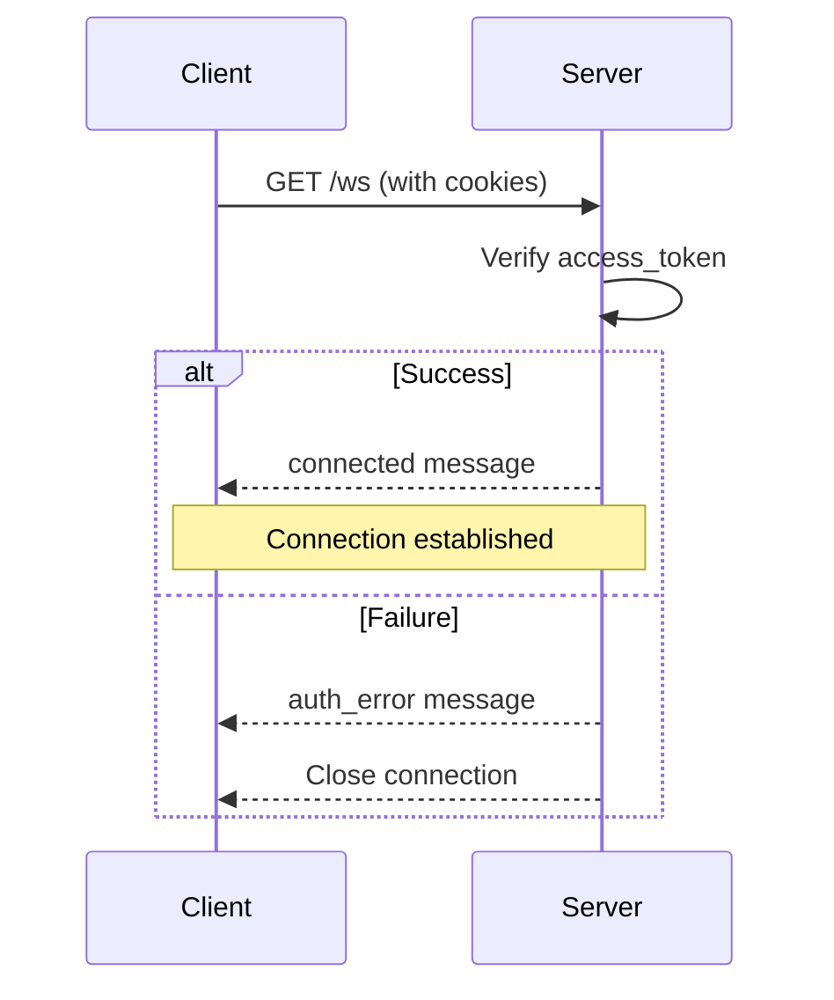

# API Reference

## Table of Contents

1. [Authentication Endpoints](#authentication-endpoints)
2. [Monitoring Endpoints](#monitoring-endpoints)
3. [WebSocket Protocol](#websocket-protocol)
4. [Event Types](#event-types)
5. [Error Codes](#error-codes)

---

## Authentication Endpoints

All authentication endpoints use HTTP-ONLY cookies for token storage (secure, XSS-protected).

### POST /api/auth/login

Login with email and password, sets HTTP-ONLY cookies.

**Request Body:**

```typescript
{
	email: string; // Valid email format
	password: string; // Minimum 1 character
}
```

**Response (200 OK):**

```typescript
{
	userId: string;
	expiresAt: number; // Timestamp (ms) when access token expires
}
```

**Cookies Set:**

- `access_token` - Access token (5 minutes, httpOnly, sameSite=strict)
- `refresh_token` - Refresh token (7 days, httpOnly, sameSite=strict)

**Example:**

```typescript
const response = await fetch('/api/auth/login', {
	method: 'POST',
	headers: { 'Content-Type': 'application/json' },
	credentials: 'include', // CRITICAL: Include cookies
	body: JSON.stringify({
		email: 'user@example.com',
		password: 'password123',
	}),
});

const { userId, expiresAt } = await response.json();
```

**Error Responses:**

- `400` - Invalid email format or missing password
- `401` - Invalid credentials

---

### POST /api/auth/refresh

Refresh access token using refresh token from cookie.

**IMPORTANT:** Also updates ALL WebSocket sessions for this user.

**Request:** None (uses `refresh_token` cookie)

**Response (200 OK):**

```typescript
{
	userId: string;
	expiresAt: number; // New expiration timestamp
}
```

**Cookies Updated:**

- `access_token` - New access token (5 minutes)

**Example:**

```typescript
const response = await fetch('/api/auth/refresh', {
	method: 'POST',
	credentials: 'include', // CRITICAL: Include cookies
});

const { userId, expiresAt } = await response.json();
```

**Error Responses:**

- `401` - No refresh token or invalid/expired token

---

### POST /api/auth/logout

Logout user, clears cookies.

**Request:** None (uses cookies)

**Response (200 OK):**

```typescript
{
	success: boolean;
}
```

**Cookies Cleared:**

- `access_token`
- `refresh_token`

**Example:**

```typescript
await fetch('/api/auth/logout', {
	method: 'POST',
	credentials: 'include',
});

// Redirect to login page
window.location.href = '/login';
```

---

### GET /api/auth/session

Check current session status.

**Request:** None (uses `access_token` cookie)

**Response (200 OK):**

```typescript
{
  authenticated: boolean;
  userId?: string;      // Present if authenticated
  expiresAt?: number;   // Present if authenticated
}
```

**Example:**

```typescript
const response = await fetch('/api/auth/session', {
	credentials: 'include',
});

const session = await response.json();

if (session.authenticated) {
	console.log('User:', session.userId);
	console.log('Expires:', new Date(session.expiresAt));
} else {
	console.log('Not authenticated');
}
```

---

## Monitoring Endpoints

Monitoring endpoints for transport layer health and statistics.

### GET /api/monitoring/transport/health

Health check endpoint - **no authentication required**.

**Response (200 OK):**

```typescript
{
	transport: 'ok' | 'error';
	auth: 'ok' | 'error';
	connectedClients: number;
	uptime: number; // Server uptime in milliseconds
	timestamp: number; // Current timestamp
}
```

**Example:**

```typescript
const response = await fetch('/api/monitoring/transport/health');
const health = await response.json();

if (health.transport === 'ok' && health.auth === 'ok') {
	console.log('All systems operational');
	console.log(`Connected clients: ${health.connectedClients}`);
	console.log(`Uptime: ${health.uptime / 1000}s`);
}
```

**Use Cases:**

- Load balancer health checks
- Monitoring dashboards
- Alerting systems

---

### GET /api/monitoring/transport/stats

Get transport server statistics - **no authentication required**.

**Response (200 OK):**

```typescript
{
  connectedClients: number;
  totalUsers: number;
  avgSessionsPerUser: number;
  subscriptions: {
    [eventType: string]: number; // Count per event type
  };
  uptime: number;
  timestamp: number;
}
```

**Example:**

```typescript
const response = await fetch('/api/monitoring/transport/stats');
const stats = await response.json();

console.log(`${stats.connectedClients} clients connected`);
console.log(`${stats.totalUsers} unique users`);
console.log(`Avg ${stats.avgSessionsPerUser.toFixed(2)} sessions per user`);

// Subscription breakdown
Object.entries(stats.subscriptions).forEach(([event, count]) => {
	console.log(`${event}: ${count} subscribers`);
});
```

**Use Cases:**

- Performance monitoring
- Capacity planning
- Usage analytics

---

### GET /api/monitoring/transport/sessions

Get all active WebSocket sessions - **authentication required**.

**Note:** In production, this should be restricted to ADMIN role.

**Response (200 OK):**

```typescript
{
	sessions: Array<{
		clientId: string;
		userId: string;
		createdAt: number;
		lastActivity: number;
		tokenExpiresAt: number;
		subscribedEvents: string[];
	}>;
	totalSessions: number;
	totalUsers: number;
	timestamp: number;
}
```

**Example:**

```typescript
const response = await fetch('/api/monitoring/transport/sessions', {
	credentials: 'include', // Must be authenticated
});

const { sessions, totalSessions, totalUsers } = await response.json();

sessions.forEach(session => {
	console.log(`User ${session.userId} (${session.clientId})`);
	console.log(`  Created: ${new Date(session.createdAt)}`);
	console.log(`  Last activity: ${new Date(session.lastActivity)}`);
	console.log(`  Expires: ${new Date(session.tokenExpiresAt)}`);
	console.log(`  Subscribed to: ${session.subscribedEvents.join(', ')}`);
});
```

**Response for Non-Authenticated:**

```typescript
{
  sessions: [],
  totalSessions: 0,
  totalUsers: 0,
  timestamp: number
}
```

**Use Cases:**

- Admin dashboards
- User session management
- Debugging connection issues

---

## WebSocket Protocol

### Connection

**Endpoint:** `ws://localhost:3000/ws` (or `wss://` in production)

**Authentication:** Cookies sent automatically by browser during WebSocket upgrade.

**Connection Flow:**



### Message Types

#### Connected

Sent immediately after successful authentication.

```typescript
{
	type: 'connected';
	clientId: string;
	userId: string;
	tokenExpiresAt: number;
}
```

#### Auth Error

Sent when authentication fails.

```typescript
{
	type: 'auth_error';
	message: string;
}
```

#### Token Expiring Soon

Warning sent 2 minutes before token expiration.

```typescript
{
	type: 'token_expiring_soon';
	expiresAt: number;
	timeRemaining: number; // Milliseconds remaining
}
```

#### Token Expired

Sent when token has expired. Connection will be closed.

```typescript
{
	type: 'token_expired';
	message: string;
}
```

#### Subscription Control

**Subscribe to events:**

```typescript
// Client -> Server
{
	type: 'subscription';
	action: 'subscribe';
	events: ['task:created', 'task:updated'];
}
```

**Unsubscribe from events:**

```typescript
// Client -> Server
{
	type: 'subscription';
	action: 'unsubscribe';
	events: ['worker:heartbeat'];
}
```

**Confirmation:**

```typescript
// Server -> Client
{
  type: 'subscription_updated';
  action: 'subscribe' | 'unsubscribe';
  events: string[];
}
```

#### Request

HTTP-like request over WebSocket.

```typescript
{
  id: string;              // Unique request ID
  method: 'GET' | 'POST' | 'PUT' | 'PATCH' | 'DELETE';
  path: string;            // API path (e.g., '/api/tasks')
  query?: Record<string, any>;
  params?: Record<string, string>;
  body?: any;
  headers?: Record<string, string>;
  timestamp: number;
}
```

**Example:**

```typescript
// GET /api/tasks?status=pending
{
  id: 'req_123',
  method: 'GET',
  path: '/api/tasks',
  query: { status: 'pending' },
  timestamp: Date.now()
}

// POST /api/tasks
{
  id: 'req_124',
  method: 'POST',
  path: '/api/tasks',
  body: {
    name: 'New task',
    priority: 1
  },
  timestamp: Date.now()
}
```

#### Response

Response to a request.

```typescript
{
  id: string;              // Matches request ID
  status: number;          // HTTP status code
  body?: any;              // Response data
  error?: {
    code: string;
    message: string;
  };
  headers?: Record<string, string>;
  timestamp: number;
}
```

**Success Example:**

```typescript
{
  id: 'req_123',
  status: 200,
  body: {
    tasks: [
      { id: '1', name: 'Task 1', status: 'pending' }
    ]
  },
  timestamp: Date.now()
}
```

**Error Example:**

```typescript
{
  id: 'req_124',
  status: 404,
  error: {
    code: 'NOT_FOUND',
    message: 'Task not found'
  },
  timestamp: Date.now()
}
```

#### Event

Real-time event broadcast from server.

```typescript
{
	id: string; // Unique event ID
	type: string; // Event type (e.g., 'task:created')
	data: any; // Event data
	timestamp: number;
}
```

**Example:**

```typescript
{
  id: 'event_456',
  type: 'task:created',
  data: {
    id: 'task-123',
    name: 'New task',
    status: 'pending',
    createdAt: Date.now()
  },
  timestamp: Date.now()
}
```

---

## Event Types

Events follow the pattern: `{resource}:{action}`

### CRUD Events

All resources support these standard events:

| Event Type                  | Description      | Data Type            |
| --------------------------- | ---------------- | -------------------- |
| `{resource}:created`        | Resource created | Full resource object |
| `{resource}:updated`        | Resource updated | Full resource object |
| `{resource}:deleted`        | Resource deleted | Full resource object |
| `{resource}:status_changed` | Status changed   | Full resource object |

**Resources:**

- `task` - Tasks
- `worker` - Workers
- `workspace` - Workspaces

**Examples:**

- `task:created`
- `worker:updated`
- `workspace:deleted`

### Business Events

Domain-specific events:

| Event Type                 | Description             | Data                                       |
| -------------------------- | ----------------------- | ------------------------------------------ |
| `task:assigned`            | Task assigned to worker | `{ taskId, workerId, assignedAt }`         |
| `task:priority_changed`    | Task priority changed   | `{ taskId, oldPriority, newPriority }`     |
| `worker:heartbeat`         | Worker health check     | `{ workerId, timestamp, status }`          |
| `worker:capacity_changed`  | Worker capacity updated | `{ workerId, capacity }`                   |
| `workspace:quota_exceeded` | Quota exceeded          | `{ workspaceId, quotaType, usage, limit }` |
| `workspace:archived`       | Workspace archived      | `{ workspaceId, archivedAt }`              |

---

## Error Codes

Standard error codes used throughout the API.

### HTTP Status Codes

| Code | Meaning               | Usage                               |
| ---- | --------------------- | ----------------------------------- |
| 200  | OK                    | Successful request                  |
| 400  | Bad Request           | Invalid input/validation error      |
| 401  | Unauthorized          | Not authenticated                   |
| 403  | Forbidden             | Authenticated but not authorized    |
| 404  | Not Found             | Resource not found                  |
| 409  | Conflict              | Resource conflict (e.g., duplicate) |
| 422  | Unprocessable Entity  | Valid format but unprocessable      |
| 500  | Internal Server Error | Server error                        |

### Error Response Format

```typescript
{
	id: string; // Request ID
	status: number; // HTTP status code
	error: {
		code: string; // Error code (see below)
		message: string; // Human-readable message
	}
	timestamp: number;
}
```

### Error Codes

| Code                   | Status | Description                          |
| ---------------------- | ------ | ------------------------------------ |
| `BAD_REQUEST`          | 400    | Invalid request format or parameters |
| `VALIDATION_ERROR`     | 400    | Input validation failed              |
| `UNAUTHORIZED`         | 401    | Not authenticated                    |
| `INVALID_TOKEN`        | 401    | Invalid or expired token             |
| `FORBIDDEN`            | 403    | Insufficient permissions             |
| `NOT_FOUND`            | 404    | Resource not found                   |
| `CONFLICT`             | 409    | Resource already exists              |
| `UNPROCESSABLE_ENTITY` | 422    | Cannot process valid request         |
| `INTERNAL_ERROR`       | 500    | Server error                         |

**Example Error:**

```typescript
{
  id: 'req_789',
  status: 404,
  error: {
    code: 'NOT_FOUND',
    message: 'Task with ID task-999 not found'
  },
  timestamp: 1234567890000
}
```

---

## Type Safety

All endpoints use Zod schemas for validation and TypeScript type inference.

**Contract Definition:**

```typescript
// packages/shared-frontend-backend/src/api/auth.contract.ts
export const AUTH_API_ROUTES = defineRoutes({
	'/api/auth/login': {
		POST: {
			body: LoginRequestSchema,
			response: LoginResponseSchema,
		},
	},
});
```

**Frontend Usage:**

```typescript
import type { LoginRequest, LoginResponse } from '@app/shared';

const request: LoginRequest = {
	email: 'user@example.com',
	password: 'password123',
};

const response: LoginResponse = await transport.request('POST', '/api/auth/login', { body: request });
```

**Backend Usage:**

```typescript
add('POST', '/api/auth/login', async ({ body }) => {
	// body is typed as LoginRequest
	const { email, password } = body;

	// Return type is automatically LoginResponse
	return {
		userId: 'user-123',
		expiresAt: Date.now() + 300000,
	};
});
```

---

## Rate Limiting

**Not currently implemented.** Consider adding rate limiting for production:

- Login attempts: 5 per minute per IP
- API requests: 100 per minute per user
- WebSocket connections: 5 per user

---

## CORS

Configure CORS for frontend access:

```typescript
// server.ts
await fastify.register(require('@fastify/cors'), {
	origin: process.env.FRONTEND_URL || 'http://localhost:5173',
	credentials: true, // CRITICAL: Allow cookies
});
```

---

## References

- [Transport Layer Documentation](../../web-backend/docs/TRANSPORT_LAYER.md)
- [Security Guide](../../web-backend/docs/SECURITY.md)
- [Deployment Guide](../../web-backend/docs/DEPLOYMENT.md)
- [Zod Documentation](https://zod.dev/)
- [Fastify Documentation](https://www.fastify.io/)
