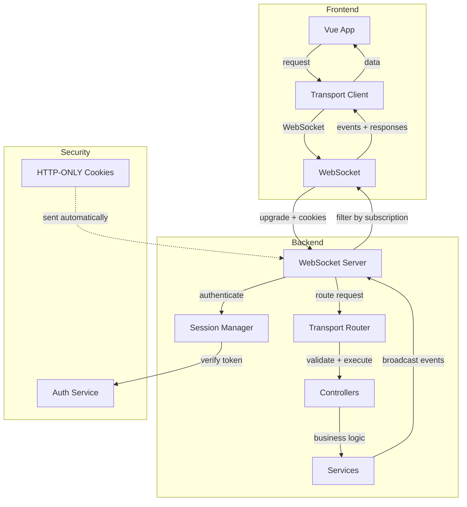
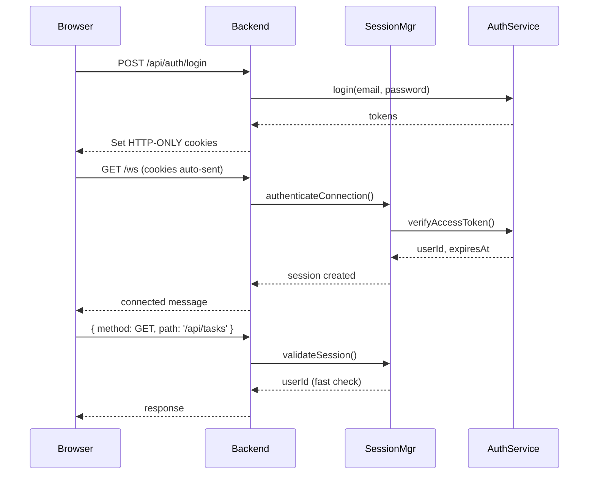
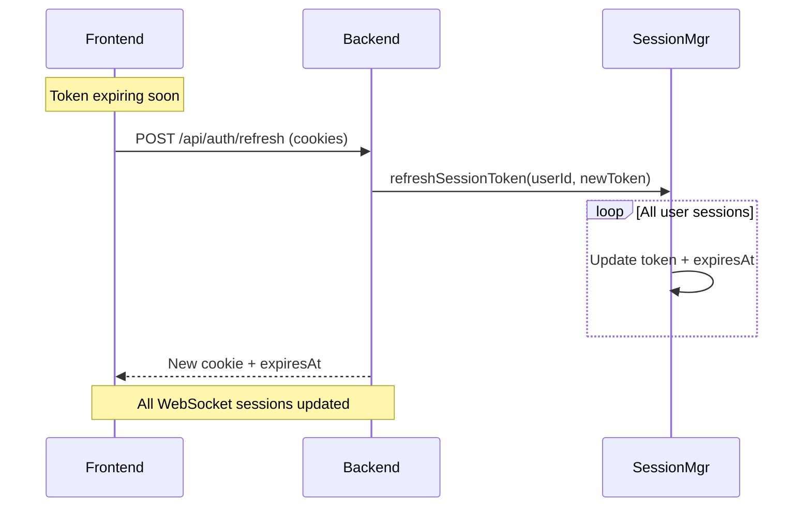

# Transport Layer Architecture

## Overview

The Transport Layer provides a secure, real-time communication channel between the web frontend and backend using WebSockets. It abstracts HTTP-like request/response patterns over WebSocket connections while adding real-time event broadcasting capabilities.

## Architecture Diagram



## Key Components

### 1. ITransportServer Interface

The core abstraction for server-side transport implementations.

**File:** `src/transport/ITransportServer.ts`

**Methods:**

- `initialize(app: FastifyInstance)`: Register WebSocket routes
- `broadcast<E>(event: E, data: EventData<E>)`: Send event to all connected clients
- `sendToClient<E>(clientId: string, event: E, data: EventData<E>)`: Send event to specific client
- `onClientConnected(handler)`: Register connection handler
- `onClientDisconnected(handler)`: Register disconnection handler
- `getConnectedClients()`: Get list of connected client IDs

### 2. WebSocketTransportServer

Production implementation of `ITransportServer` using `@fastify/websocket`.

**File:** `src/transport/adapters/WebSocketTransportServer.ts`

**Features:**

- HTTP cookie-based authentication
- Session management integration
- Subscription-based event filtering
- Automatic token expiration handling
- Token expiry warnings (2 minutes before expiration)

**WebSocket Endpoint:** `GET /ws`

### 3. TransportSessionManager

Manages authenticated sessions for all transport types with unified authentication and subscription tracking.

**File:** `src/transport/TransportSessionManager.ts`

**Responsibilities:**

- Parse HTTP cookies from connection upgrade request
- Authenticate connections using AuthService
- Track session metadata (userId, token, expiration, subscriptions, transport type)
- Multi-device support (multiple sessions per user)
- Multi-transport support (WebSocket, SSE, Long Polling, HTTP, Mock)
- Automatic cleanup of expired sessions (every 60 seconds)
- Subscription management per client
- Transport type detection and tracking

**Session Data:**

```typescript
interface BaseSession {
	clientId: string;
	userId: string;
	accessToken: string;
	tokenExpiresAt: number;
	createdAt: number;
	lastActivity: number;
	subscribedEvents: Set<string>;
	eventFilters: Map<string, Record<string, unknown>>;
}

interface TransportSession extends BaseSession {
	transportType: TransportType; // 'websocket' | 'sse' | 'long-polling' | 'http' | 'mock'
}
```

### 4. TransportRouter

Routes WebSocket requests to appropriate controllers.

**File:** `src/transport/TransportRouter.ts`

**Responsibilities:**

- Parse TransportRequest (method, path, body, query, params)
- Match path to registered routes
- Execute controller handlers
- Serialize response as TransportResponse
- Error handling and formatting

### 5. EventBroadcaster

Type-safe event broadcasting service.

**File:** `src/transport/EventBroadcaster.ts`

**Methods:**

- `broadcast<E>(event: E, data: EventData<E>)`: Broadcast to all subscribed clients
- `sendToClient<E>(clientId, event, data)`: Send to specific client
- `sendToUser<E>(userId, event, data)`: Send to all sessions of a user (multi-device)

## Security Model

### HTTP-ONLY Cookies

Tokens are stored in HTTP-ONLY cookies, never accessible to JavaScript:

```typescript
reply.setCookie('access_token', accessToken, {
	httpOnly: true, // Not accessible via JavaScript
	secure: isProduction, // HTTPS only in production
	sameSite: 'strict', // CSRF protection
	path: '/',
	maxAge: 300, // 5 minutes
});
```

### Authentication Flow



### Token Refresh Flow



**Key Security Features:**

1. Tokens never in WebSocket messages
2. Tokens never in JavaScript-accessible storage
3. Automatic browser cookie management
4. Multi-device token synchronization
5. XSS protection (httpOnly)
6. CSRF protection (sameSite=strict)

## WebSocket Protocol

### Message Types

#### 1. Connection Messages

**Connected:**

```json
{
	"type": "connected",
	"clientId": "client_1234567890_abc123",
	"userId": "user-123",
	"tokenExpiresAt": 1234567890000
}
```

**Auth Error:**

```json
{
	"type": "auth_error",
	"message": "Authentication failed"
}
```

**Token Expiring Soon (2 min warning):**

```json
{
	"type": "token_expiring_soon",
	"expiresAt": 1234567890000,
	"timeRemaining": 120000
}
```

**Token Expired:**

```json
{
	"type": "token_expired",
	"message": "Access token expired, please refresh"
}
```

#### 2. Subscription Messages

**Subscribe:**

```json
{
	"type": "subscription",
	"action": "subscribe",
	"events": ["task:created", "task:updated"]
}
```

**Unsubscribe:**

```json
{
	"type": "subscription",
	"action": "unsubscribe",
	"events": ["worker:heartbeat"]
}
```

**Confirmation:**

```json
{
	"type": "subscription_updated",
	"action": "subscribe",
	"events": ["task:created", "task:updated"]
}
```

#### 3. Request/Response

**Request:**

```json
{
	"id": "req_1234567890_xyz789",
	"method": "GET",
	"path": "/api/tasks",
	"query": { "status": "pending" },
	"timestamp": 1234567890000
}
```

**Response (Success):**

```json
{
  "id": "req_1234567890_xyz789",
  "status": 200,
  "body": { "tasks": [...] },
  "timestamp": 1234567890123
}
```

**Response (Error):**

```json
{
	"id": "req_1234567890_xyz789",
	"status": 404,
	"error": {
		"code": "NOT_FOUND",
		"message": "Task not found"
	},
	"timestamp": 1234567890123
}
```

#### 4. Events

```json
{
	"id": "event_1234567890_def456",
	"type": "task:created",
	"data": {
		"id": "task-123",
		"name": "New task",
		"status": "pending"
	},
	"timestamp": 1234567890000
}
```

## Event Types

Events follow a consistent naming pattern: `{resource}:{action}`

### Resource Events (CRUD)

```typescript
type CrudEventType = 'created' | 'updated' | 'deleted' | 'status_changed';
type ResourceEvent<Resource, Data> = {
	[K in CrudEventType as `${Resource}:${K}`]: Data;
};
```

Examples:

- `task:created` - New task created
- `task:updated` - Task updated
- `worker:deleted` - Worker deleted
- `workspace:status_changed` - Workspace status changed

### Business Events

Custom events for domain-specific actions:

- `task:assigned` - Task assigned to worker
- `task:priority_changed` - Task priority changed
- `worker:heartbeat` - Worker health check
- `worker:capacity_changed` - Worker capacity updated
- `workspace:quota_exceeded` - Workspace quota exceeded
- `workspace:archived` - Workspace archived

## Event Broadcasting

### Server-Side (Service)

```typescript
export class TasksService {
	constructor(
		private repository: TasksRepository,
		private eventBroadcaster: EventBroadcaster
	) {}

	async createTask(data: CreateTaskDto): Promise<Task> {
		const task = await this.repository.createTask(data);

		// Broadcast to all subscribed clients
		this.eventBroadcaster.broadcast('task:created', task);

		return task;
	}
}
```

### Client-Side (Frontend)

```typescript
export const TasksPage = () => {
	const transport = useTransport();

	useEffect(() => {
		// Subscribe to specific events
		const unsubscribe = transport.subscribe('task:created', task => {
			console.log('New task:', task);
			// Update UI
		});

		return () => unsubscribe();
	}, [transport]);
};
```

## Subscription Filtering

Clients subscribe to specific events, and the server only sends subscribed events.

**Benefits:**

- Reduced bandwidth (40-60% in typical scenarios)
- Less CPU usage (fewer JSON serializations)
- Better battery life on mobile
- Fewer React re-renders
- Better scalability

**Example Scenario:**

- Dashboard page: subscribes to `task:*` events only
- Workers page: subscribes to `worker:*` events only
- Admin page: subscribes to all events

Without filtering, all clients receive all events. With filtering, clients only receive what they need.

## Error Handling

### Client-Side Errors

```typescript
try {
	const result = await transport.request('GET', '/api/tasks');
} catch (error) {
	if (error.code === 'NOT_FOUND') {
		// Handle not found
	} else if (error.code === 'UNAUTHORIZED') {
		// Redirect to login
	} else {
		// Generic error handling
	}
}
```

### Server-Side Errors

```typescript
export class TasksController {
	async getTask(taskId: string): Promise<Task> {
		const task = await this.service.getTask(taskId);

		if (!task) {
			throw new NotFoundException(`Task ${taskId} not found`);
		}

		return task;
	}
}
```

TransportRouter automatically catches and formats errors as TransportResponse.

## Troubleshooting

### Connection Issues

**Problem:** WebSocket connection fails
**Check:**

- Are HTTP-ONLY cookies set? (Check /api/auth/login response)
- Is access token valid? (Check /api/auth/session)
- Are CORS settings correct?
- Is WebSocket upgrade allowed by proxy/load balancer?

**Problem:** Connection drops frequently
**Check:**

- Token expiration (default 5 minutes)
- Network stability
- Proxy/load balancer timeout settings

### Authentication Issues

**Problem:** "Authentication failed" on connection
**Check:**

- Verify cookies are sent in WebSocket upgrade request
- Check AuthService.verifyAccessToken() implementation
- Check cookie path and domain settings

**Problem:** Token expired immediately after refresh
**Check:**

- Clock sync between frontend and backend
- Token expiration calculation
- Cookie maxAge vs JWT exp claim

### Subscription Issues

**Problem:** Not receiving events
**Check:**

- Client subscribed to event type? (Check console logs)
- Event broadcast called in service?
- Subscription filter working? (Check SessionManager.isSubscribed)

**Problem:** Receiving too many events
**Check:**

- Subscribe only to needed events
- Unsubscribe when component unmounts
- Check event type naming (wildcards not supported)

### Performance Issues

**Problem:** High memory usage
**Check:**

- Session cleanup running? (Every 60 seconds)
- Expired sessions being removed?
- Event handler memory leaks (unsubscribe on unmount)

**Problem:** High CPU usage
**Check:**

- Too many events being broadcast?
- Are subscriptions filtering effectively?
- JSON serialization overhead (use compression for large payloads)

## Monitoring

See [API_REFERENCE.md](../../shared-frontend-backend/docs/API_REFERENCE.md) for monitoring endpoints:

- `GET /api/monitoring/transport/health` - Health check
- `GET /api/monitoring/transport/stats` - Statistics
- `GET /api/monitoring/transport/sessions` - Active sessions (auth required)

## Configuration

### Environment Variables

```bash
# Required
JWT_SECRET=your-secret-key-here
COOKIE_SECRET=your-cookie-secret-here

# Optional
NODE_ENV=production              # Use 'secure' cookies in production
WS_HEARTBEAT_INTERVAL=30000     # WebSocket heartbeat interval (ms)
SESSION_CLEANUP_INTERVAL=60000  # Session cleanup interval (ms)
TOKEN_EXPIRY=300                # Access token expiry (seconds)
REFRESH_TOKEN_EXPIRY=604800     # Refresh token expiry (seconds, 7 days)
```

### Fastify Registration

```typescript
// server.ts
import { TransportRouter } from './transport/TransportRouter';
import { TransportSessionManager } from './transport/TransportSessionManager';
import { WebSocketTransportServer } from './transport/adapters/WebSocketTransportServer';

const authService = new JwtAuthService(process.env.JWT_SECRET!);
const sessionManager = new TransportSessionManager(authService);
const router = new TransportRouter(/* ... controllers ... */);
const transportServer = new WebSocketTransportServer(sessionManager, router);

await transportServer.initialize(fastify);
```

## Best Practices

### 1. Always Unsubscribe

```typescript
useEffect(() => {
	const unsubscribe = transport.subscribe('task:created', handler);
	return () => unsubscribe(); // CRITICAL: Prevent memory leaks
}, []);
```

### 2. Subscribe to Specific Events

```typescript
// GOOD: Specific subscriptions
transport.subscribe('task:created', handler);
transport.subscribe('task:updated', handler);

// BAD: Would need to receive all events
// (subscribeAll is intentionally not supported for performance)
```

### 3. Handle Connection State

```typescript
const [isConnected, setIsConnected] = useState(false);

useEffect(() => {
	const unsubscribe = transport.onConnectionStateChange(state => {
		setIsConnected(state === 'connected');
	});
	return () => unsubscribe();
}, []);
```

### 4. Broadcast Events After State Changes

```typescript
async createTask(data: CreateTaskDto): Promise<Task> {
  const task = await this.repository.createTask(data);

  // ALWAYS broadcast after successful state change
  this.eventBroadcaster.broadcast('task:created', task);

  return task;
}
```

### 5. Use Type-Safe Event Handlers

```typescript
// GOOD: Type-safe
transport.subscribe('task:created', (task: Task) => {
	console.log(task.id); // TypeScript knows task.id exists
});

// BAD: No type safety
transport.subscribe('task:created', (data: any) => {
	console.log(data.id); // Could be undefined
});
```

## Migration Guide

### From HTTP Polling to WebSocket

1. Replace HTTP fetch calls with transport.request()
2. Add event subscriptions for real-time updates
3. Update UI on event reception
4. Remove polling intervals

**Before:**

```typescript
useEffect(() => {
	const interval = setInterval(async () => {
		const tasks = await fetch('/api/tasks').then(r => r.json());
		setTasks(tasks);
	}, 5000);
	return () => clearInterval(interval);
}, []);
```

**After:**

```typescript
useEffect(() => {
	// Initial fetch
	transport.request('GET', '/api/tasks').then(setTasks);

	// Subscribe to updates
	const unsubscribe = transport.subscribe('task:created', task => {
		setTasks(prev => [...prev, task]);
	});

	return () => unsubscribe();
}, []);
```

## References

- [API Reference](../../shared-frontend-backend/docs/API_REFERENCE.md)
- [Security Guide](./SECURITY.md)
- [Deployment Guide](./DEPLOYMENT.md)
- [Transport Protocol Types](../../shared-frontend-backend/src/transport/index.ts)
- [Event Types](../../shared-frontend-backend/src/transport/EventTypes.ts)
